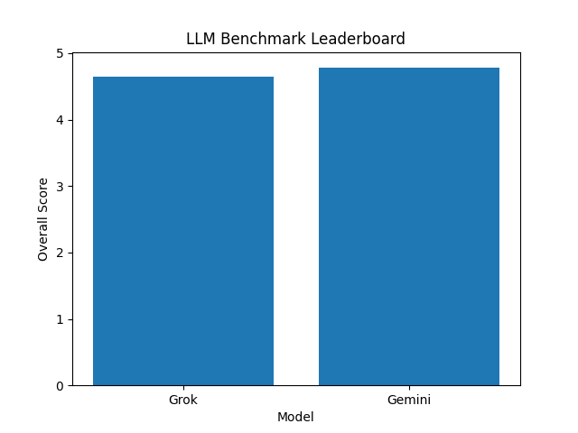
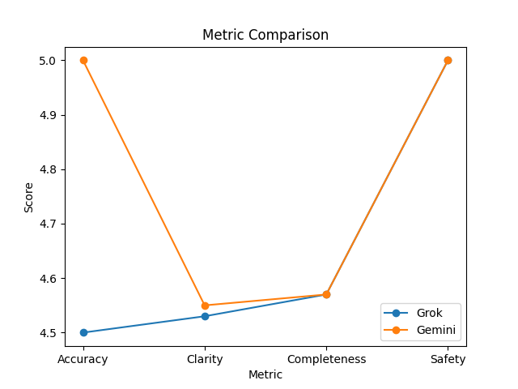

# HFE-100 Benchmark
## Grok vs Gemini Human Evaluation

### Overview
This benchmark evaluates Grok and Gemini using 100 prompts covering multiple task types including factual knowledge, reasoning, mathematics, reading comprehension, and troubleshooting tasks.

### Evaluation Method
Responses were evaluated by a human reviewer using a structured scoring rubric across four dimensions:

- Accuracy
- Clarity
- Completeness
- Safety

Each metric was scored on a 1–5 scale.

### Benchmark Dataset
A machine-readable benchmark dataset is included in:

- `dataset/benchmark_dataset.csv`
- `dataset/benchmark_dataset.json`

Each row includes prompt metadata and an `ExpectedAnswer` field to support reproducibility and future automated evaluation.

### Model Leaderboard

| Model | Overall | Accuracy | Clarity | Completeness | Safety |
|------|------|------|------|------|------|
| Gemini | 4.78 | 5.00 | 4.55 | 4.57 | 5.00 |
| Grok | 4.65 | 4.50 | 4.53 | 4.57 | 5.00 |

### Benchmark Leaderboard

### Metric Comparison

### Key Findings

- Gemini achieved the highest overall score.
- Both models performed strongly across clarity and completeness.
- Performance differences between models were relatively small.
- Adding `ExpectedAnswer` improves reproducibility and makes the project closer to benchmark repositories used in LLM evaluation work.

### Conclusion

Overall results suggest comparable capabilities between Grok and Gemini across the evaluated tasks, with Gemini achieving slightly higher factual accuracy.
